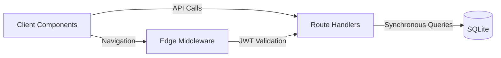
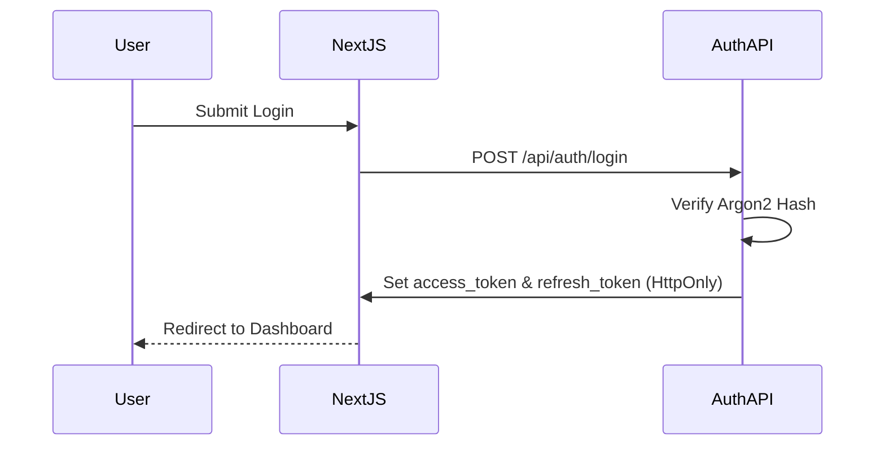
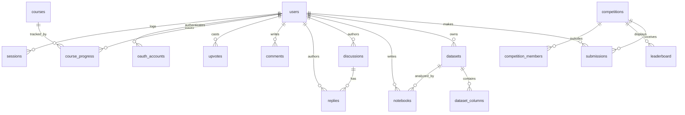

# KaggleLite

A high-performance clone of the Kaggle data science platform. Built as a fast, localized application to demonstrate complex full-stack capabilities including secure authentication, leaderboards, and structured dataset browsing.

Live demo: [ADD LINK]
Demo login: demo@kagglelite.com / password123

## Screenshots
- [Home Page](/docs/screenshots/home.png)
- [Competitions](/docs/screenshots/competitions.png)
- [Dataset Detail](/docs/screenshots/dataset-detail.png)
- [Notebook Editor](/docs/screenshots/notebook.png)
- [Leaderboard](/docs/screenshots/leaderboard.png)

## Features
- **Competitions**: Dynamic routing, submission tables, and public leaderboards.
- **Datasets**: Dataset listing, details, and upvoting mechanics.
- **Notebooks**: Markdown and code cell rendering, comment threads.
- **Discussions**: Topics, nested replies, upvoting.
- **Learn**: Course progression and completion tracking.
- **Models**: Pre-trained model browsing and metadata.
- **Auth**: Premium split-screen UI, JWT opaque rotation, Argon2, TOTP 2FA, session revocation, GitHub OAuth.
- **Search**: Global debounced entity searching across categories.

## Tech Stack
| Layer | Technology | Why I chose it |
|---|---|---|
| Frontend | Next.js App Router | Fast server-rendered components and simplified route handling. |
| Styling | Tailwind CSS | Utility-first styling enabling rapid, consistent UI development. |
| Database | better-sqlite3 | Zero-config, file-based SQL, allowing for simple seeding and high performance. |
| Auth Security | Jose & Argon2 | Edge-compatible JWT verification combined with robust password hashing. |
| Forms | React Hook Form & Zod | Type-safe client-side validation synced with server constraints. |

## Architecture
KaggleLite leverages the Next.js App Router for both UI and API. The client communicates with the RESTful route handlers in `app/api`. These handlers query the local `better-sqlite3` database synchronously. The Edge middleware utilizes `jose` to intercept and validate HTTP-only JWTs, ensuring ultra-fast route protection without hitting the database.

## Database Schema

## API Reference
| Method | Endpoint | Auth Required | Description |
|---|---|---|---|
| POST | `/api/auth/login` | No | Authenticate user and set cookies. |
| POST | `/api/auth/register` | No | Create new user account. |
| POST | `/api/auth/refresh` | Yes | Rotate opaque refresh tokens. |
| GET | `/api/auth/me` | Yes | Return current user session. |
| GET | `/api/auth/sessions` | Yes | List active devices/sessions. |
| GET | `/api/competitions` | No | List all competitions. |
| GET | `/api/competitions/[slug]/leaderboard` | No | Fetch public leaderboard. |
| GET | `/api/datasets` | No | Browse available datasets. |
| POST | `/api/notebooks/[slug]/comments` | Yes | Comment on a notebook. |
| GET | `/api/search` | No | Global entity search query. |

## Getting Started
**Prerequisites**: Node.js 20+

1. Clone the repository.
2. Run `npm install --legacy-peer-deps` to install dependencies.
3. Run `npm run seed` to generate `data/kagglelite.db` with dummy data.
4. Run `npm run dev` to start the local development server.
5. Open `http://localhost:3000` in your browser.

## Folder Structure
- `app/` - Next.js App Router UI pages and layouts.
  - `api/` - RESTful route handlers serving backend logic.
- `components/` - Reusable UI elements (auth, layouts, forms).
- `lib/` - Core utilities (auth helpers, database singleton, mailer).
- `scripts/` - Database migration and seeding scripts.

## Design Decisions and Trade-offs
- **SQLite**: Chose local `better-sqlite3` for zero-configuration, ensuring recruiters can simply `npm run seed` without managing Postgres credentials.
- **JWT in HttpOnly Cookies**: Adopted for cross-site scripting (XSS) immunity. Opaque refresh tokens are used to enable server-side session revocation.
- **Route Handlers as REST**: Decoupled the backend API from Server Components to allow for a clearer separation of concerns.
- **Dummy Seeded Data**: Prevented the need for scraping real Kaggle data or relying on third-party APIs that might break over time.

## Limitations and Future Improvements
- **Execution**: Notebook code rendering is purely aesthetic; real arbitrary Python execution is dangerous and omitted.
- **File Storage**: Dataset downloads are mocked to prevent large bandwidth consumption; real implementation would require AWS S3 or R2.
- **Rate Limiting**: Currently utilizing an in-memory sliding window which resets on server restart; Redis would be required for clustered deployments.
- **Database Limits**: SQLite handles concurrent reads perfectly but suffers under heavy concurrent writes; a true SaaS needs a dedicated remote database.

## Author
Mohd. Rizwan  
GitHub: [GITHUB_LINK]  
LinkedIn: [LINKEDIN_LINK]  
Email: [EMAIL]
